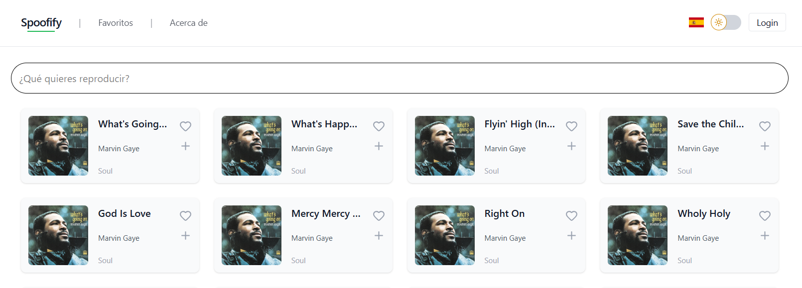

# 🎧 Spoofify

Aplicación web desarrollada con React que permite explorar canciones, buscar música, ver detalles y gestionar una lista de favoritos.

---

## 📌 Descripción

Spoofify es una SPA (Single Page Application) que simula un reproductor de música.  
Permite a los usuarios descubrir canciones, filtrarlas dinámicamente y guardar sus favoritas.

La aplicación consume datos desde una API simulada (MockAPI) y cuenta con múltiples páginas conectadas mediante React Router.

---

## 🚀 Funcionalidades

- 🔎 Búsqueda dinámica en tiempo real
- ❤️ Sistema de favoritos con persistencia (LocalStorage)
- 🌍 Multi-idioma (Español / Inglés)
- 🌙 Modo oscuro
- 📜 Scroll infinito (paginación)
- 🎵 Página de detalles de canciones

---

## 🆕 Funcionalidades nuevas (Frontend)

- 🧑‍💻 Implementación de Context/AuthProvider para autenticación global
- 🔐 Protección de rutas privadas (usuarios no autenticados)
- ❤️ Integración de favoritos con backend
- 📋 Página de registro de usuarios
- 🚪 Logout funcional
- ⭐ Visualización de favoritos del usuario
- ⚠️ Página Not Found (404) para rutas inexistentes

---

## 🛠️ Tecnologías utilizadas

- React
- Tailwind CSS
- React Router DOM
- i18next (multi-idioma)
- MockAPI (API simulada)
- Vite
- Vitest
- React Testing Library
- html2canvas + jsPDF (exportación PDF)

---

## 📄 Exportación PDF

La aplicación permite exportar contenido visual (cards/artistas) a PDF utilizando:

    html2canvas para capturar el componente
    jsPDF para generar y descargar el archivo

📥 El PDF se descarga automáticamente en la carpeta Descargas del navegador con el nombre del artista o elemento seleccionado.

---

## 📂 Estructura del proyecto

```bash
    public/
    ├── flags/
    ├── favicon.svg
    └── icons.svg
    src/
    ├── assets/
    ├── components/
    ├── contexts/
    ├── hooks/
    ├── pages/
    ├── services/
    ├── tests/
    ├── utils/
    ├── App.jsx
    ├── i18n.js
    └── main.jsx

```
---
## 📞 Comunicación con Backend

    La aplicación consume la API configurada mediante:

```bash
    VITE_API_BASE
```
Ejemplo:

```bash
    VITE_API_BASE=http://localhost:5000
```
---

## ⚙️ Instalación y ejecución

1. Clonar el repositorio:

```bash
    git clone https://github.com/DuboscqDylan/react_tp2_grupo16.git
```

2. Entrar al proyecto:

```bash
    cd react_tp2_grupo16
```

3. Instalar dependencias:
   
```bash
    npm install
#librería de iconos
    npm install react-router-dom
    npm install lucide-react
#multi-idioma
    npm install i18next react-i18next
#descargarPDF
    npm install jspdf html2canvas 
```

4. Ejecutar el proyecto:
   
```bash
   npm run dev
```
5. La aplicación estará disponible en:

    http://localhost:5173

---

## 🧪 Configuración de Testing


1. Instalar dependencias :

    Se instalaron las librerías necesarias para testing:

```bash
    npm install -D vitest jsdom @testing-library/react @testing-library/jest-dom @testing-library/user-event
```

2. Configurar `vite.config.js`
   
   Añadir la siguiente a configuracion dentro de `defineConfig()`:
   
```js   
    test: {
        globals: true,
        environment: "jsdom",
        setupFiles: "./src/tests/setup.js",
    }
```

3. Crear archivo de setup `src/tests/setup.js` con esta línea de código:
   
```js
    import "@testing-library/jest-dom";
```

4. Añadir a `package.json` los scripts para ejecutar los tests :
   
```json 
    "scripts": {
        "test": "vitest",
        "test:run": "vitest run"
    }
```

5. Ejecutar los tests :
   
    a. Modo interactivo

```bash 
    'npm run test'
```

    b. Ejecutar una sola vez 

```bash 
    'npm run test:run'
```

6. Integración continua (CI)

    Los test se ejecutan automaticamente al hacer pull request con github actions gracias al archivo:

```txt    
     .github/workflows/ci.yml.
```

---

## ✔️ Componentes testeados

- FavoriteButton
- CardSong
- DarkModeToggle
- EmptyState
- ErrorState
- ListSongs
- LoadingState
- NavBar
- NavItem
- SearchBar
- Sentinel

---

## 🚀 Funcionalidades Testing

Se utilizaron Vites y React Testing Library para validar:

- Renderizado de componentes
- Manejo de props
- Eventos del usuario
- Estados vacíos, carga y error
- Navegación y renderizado dinámico

---

## 🌐 API utilizada

    Se utilizó MockAPI para simular los datos:

```bash
    GET /song
    GET /song/:id
```

---

## 📋 Notas

    Se utilizó LocalStorage para persistir favoritos y preferencias (idioma y tema).
    Se implementó búsqueda avanzada con múltiples criterios.
    La aplicación fue diseñada con enfoque responsive y experiencia de usuario.
---

## 📷 Nuestra API



---

## 👩‍💻 Integrantes
    Cyntia Nasabun
    Lucas Gabriel Cerda
    Dylan Duboscq

---

## 📎 Repositorio

     https://github.com/DuboscqDylan/react_tp2_grupo16

## 📎 Linear

     https://linear.app/pwa-cerda-duboscq/project/tp2-react-2e7cc94acbec/overview

## 📎 Vercel

     https://react-tp2-grupo16.vercel.app/